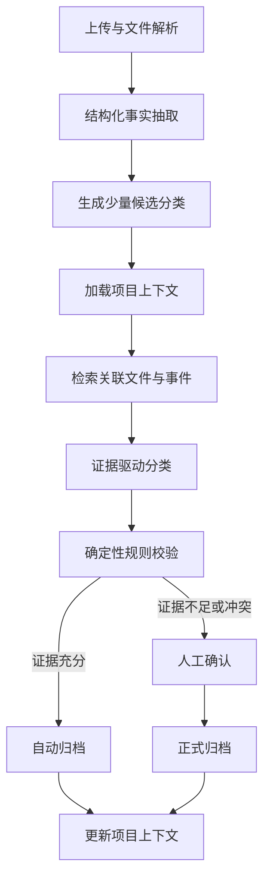

# 下一阶段：上下文感知档案分类与 Agent 实施方案

## 1. 文档定位

本文档是投资项目档案管理系统下一阶段的实施依据，重点解决当前分类器缺乏项目全局理解的问题。

典型问题是：两份文件都属于“公司章程”，但一份是尽职调查阶段收集的交易前章程，另一份是投资实施阶段形成的增资后新章程。仅凭文件名、文件内容片段和完整文件树，无法可靠判断它们在当前项目中的业务角色。

后续涉及以下工作时，应优先参考本文档：

- 文件分类架构调整；
- 项目阶段与项目事件建模；
- 文件事实、文件关系和分类证据建模；
- Agent、LangGraph 或 LangChain 集成；
- 分类人工确认与反馈闭环；
- 分类评测、自动归档门槛和灰度上线。

本文档描述目标方案，不代表所有内容已经实现。实施过程中如调整关键架构、数据模型或验收标准，应同步更新本文档。

### 当前实施状态

截至当前版本：

- 已完成君柔 35 份业务文件的机器清单和重复检测；
- 已完成 7 个项目事件的上下文草案；
- 6 个君柔金标准分类用例已于 2026-08-01 通过业务验收；
- 已将“投资合规性审查表”加入投资决策/上会材料，并建立正证据、排除项和默认人工复核规则；
- 已实现 `DocumentFactsSchema`、事实响应安全解析和降级结果；
- 已实现事实抽取器，并通过 `extractFacts=true` 或 `ENABLE_DOCUMENT_FACTS_SHADOW=true` 以 shadow mode 接入 `/api/classify`；
- 已新增 `project_contexts`、`project_events`、`document_facts` 和 `classification_decisions` Drizzle Schema 与 SQL 迁移；
- 已实现项目记忆存储层、源指纹幂等 upsert、预归档事实记录和归档后关联；
- 已通过 `persistFacts=true` 或 `PERSIST_PROJECT_MEMORY_SHADOW=true` 接入事实与 legacy 决策的可选持久化；
- 已实现 `context-decision-v2` 内存型上下文决策器，覆盖交易前/增资后公司章程、股东会决议、交割确认函、缴款通知书和投资合规性审查表；
- `/api/classify` 支持 `contextDecision=true`，可在不持久化的情况下输入项目快照和关联文件事实，返回 shadow 上下文建议；
- 已对 6 份君柔金标准原始 PDF 完成真实文件 shadow 评测：6/6 文档类型抽取正确，上下文 v2 覆盖 6 份且 6/6 命中；
- 评测确认 6 份 PDF 全部无文字层，OCR/视觉抽取是真实档案链路的必要组成；
- 已安装 `@langchain/langgraph`，实现 `classification-agent-langgraph-v1` 状态图；
- Agent 已具备证据规划、关联文件检索、条件循环、上下文决策、完成和转人工节点；
- `/api/classify` 支持 `agentDecision=true` 或 `ENABLE_CLASSIFICATION_AGENT_SHADOW=true`，返回 Agent 决策与完整执行轨迹；
- 已实现按 `projectId` 隔离的进程内会话项目记忆：逐份上传时自动检索同项目事实，新章程到达后重新判断旧章程，顺序和乱序上传均通过测试；
- 会话记忆结果已接入 Agent Shadow 面板，可显示当前记忆文件数、关联事实数和被新证据改判的历史文件；
- 君柔 Agent shadow 评测中明确建议 6 份且 6/6 命中，错误自主建议为 0；其中投资合规性审查表按类别策略继续转人工；
- Agent 调度层使用确定性规则，模型调用数为 0；前置 `DocumentFacts` 抽取仍可能调用一次 Coze LLM；
- shadow 事实暂不参与最终分类或自动归档；
- SQL 迁移尚未应用到远端 Supabase；LangGraph Agent 仍为 shadow mode，尚未接管最终分类与自动归档。

### 当前环境决策（2026-08-01）

- 开发阶段继续使用 Coze 提供的原有运行环境，不更换 Supabase 连接；
- 当前没有需要迁移的重要业务数据；
- 不在 Coze 代管的 Supabase 上尝试执行数据库结构迁移；
- `PERSIST_PROJECT_MEMORY_SHADOW` 保持关闭，开发验证使用非持久化 shadow mode 和 `tests/fixtures` 中的君柔数据；
- 最终真实上线前，由项目所有者注册自有 Supabase，一次性部署基础表与 Agent 项目记忆表，再切换环境变量。

在上述决策被明确修改前，后续开发不得要求 Coze 环境存在 `project_contexts`、`project_events`、`document_facts` 或 `classification_decisions` 表。

## 2. 下一阶段目标

下一阶段只聚焦一个核心目标：

> 让系统能够结合项目阶段、关键事件、文件事实和关联文件，正确区分“同一种文档在不同业务阶段的归档位置”。

下一阶段不以“增加更多 Prompt”或“增加更多次模型调用”为目标，而是将系统从单文件分类器升级为：

```text
项目状态模型
+ 文件事实抽取
+ 项目内证据检索
+ 证据驱动决策
+ 人工反馈闭环
```

## 3. 当前问题

当前分类流程主要为：

```text
文件解析
→ 关键词匹配
→ 必要时发送完整分类树并调用一次 LLM
→ 自动归档或人工确认
```

主要缺陷包括：

1. 模型只看到当前文件、项目名称和分类树，看不到项目阶段、交易事件和其他关联文件。
2. 系统没有区分“文件是什么”和“文件在本项目中起什么作用”。
3. 关键词高分时可能直接归档，没有项目上下文校验。
4. 数据库只保留最终分类结果，没有完整保存候选分类、支持证据、冲突证据和人工纠正。
5. 模型自报置信度不能等同于真实分类可靠度。
6. 每次发送完整文件树会增加上下文长度，但不会产生真正的项目全局理解。

## 4. 核心设计原则

### 4.1 拆分文档类型与业务角色

系统必须分别识别：

1. `documentType`：文件客观上是什么，例如公司章程、增资协议、股东会决议。
2. `archiveRole`：文件在当前项目中的业务作用，例如尽调底稿、投决附件、投资实施交割材料。

“公司章程”只能直接决定 `documentType`，不能直接决定最终归档位置。

### 4.2 项目当前阶段只是先验信息

不能仅凭 `currentStage` 强制分类，因为用户可能在投资实施阶段补传历史尽调文件。最终分类必须结合：

- 文件日期；
- 文件版本；
- 签署或盖章状态；
- 文件中的交易变化；
- 相关协议、决议和付款记录；
- 文件与具体项目事件的时间关系。

### 4.3 长期业务事实存 Supabase

LangGraph checkpoint 只表示“一次分类任务执行到哪一步”。以下长期事实必须存入 Supabase：

- 项目处于什么阶段；
- 项目发生了哪些投资事件；
- 文件包含哪些客观事实；
- 文件之间有什么关系；
- 用户最后确认了什么分类。

### 4.4 Agent 不直接执行高风险写操作

Agent 只能查询证据和提交结构化分类建议。正式归档、删除、更新项目状态等写操作必须经过普通 TypeScript 规则校验和权限控制。

## 5. 目标架构



建议技术选择：

- LangGraph：控制工作流节点、条件分支、暂停恢复和执行状态。
- `coze-coding-dev-sdk`：下一阶段继续使用现有 `LLMClient` 和 `FetchClient`。
- Supabase：保存项目事实、文件事实、分类决策和人工反馈。
- S3：继续保存文件实体。
- Zod：校验模型结构化输出和节点输入输出。
- LangChain：第一版不作为必要依赖；需要统一多模型接口或构建动态工具 Agent 时再引入。

## 6. 公司章程消歧示例

| 证据 | 更偏向尽职调查/投资决策 | 更偏向投资实施 |
|---|---|---|
| 文档日期 | 投委会或投资协议之前 | 投资协议签署或交割之后 |
| 文件版本 | 交易前现行章程 | 修订版、新章程、签署版 |
| 股权结构 | 原股东和原注册资本 | 出现本轮投资方或注册资本变化 |
| 关联文件 | 尽调报告、工商核查材料、上会附件 | 增资协议、股东会决议、付款凭证 |
| 明确措辞 | “截至基准日”“现行有效” | “本次增资完成后”“修订并通过” |
| 文件用途 | 作为尽调资料或投决参考 | 作为交割条件或工商变更材料 |

证据不足时必须人工确认，不得仅依赖模型自报置信度自动归档。

## 7. 分阶段实施计划

### 阶段一：建立评测基线

预计用时：2–3 天。

在修改分类逻辑前建立 50–100 份脱敏评测样本，优先覆盖：

- 尽调阶段公司章程；
- 投资实施阶段新章程；
- 投决材料与尽调材料中的同类证照；
- 交易前和交易后股东名册；
- 多版本增资协议；
- 文件晚传、补传和跨阶段上传；
- 内容不足或扫描模糊的文件。

建议测试数据结构：

```ts
interface ClassificationCase {
  fileName: string;
  projectStage: string;
  documentType: string;
  expectedCategoryId: string;
  relatedDocuments: string[];
  decisiveEvidence: string[];
}
```

建议新增：

```text
tests/
├── fixtures/
│   └── classification-cases.json
├── context-classification.test.ts
└── classification-evaluation.ts
```

记录以下基线指标：

- 全部样本 Top-1 准确率；
- 同类型不同阶段样本准确率；
- 自动归档错误率；
- 人工确认比例；
- 单文件模型调用次数、耗时和成本。

### 阶段二：补充业务数据模型

预计用时：3–4 天。

#### `project_contexts`

保存项目总体背景：

```text
project_id
current_stage
stage_confidence
summary
target_company
investors
key_dates
updated_at
```

建议阶段枚举：

```text
pre_initiation
initiation
due_diligence
investment_decision
investment_execution
post_investment
exit_decision
exit_execution
unknown
```

#### `project_events`

保存项目实际发生的业务事件：

```text
id
project_id
event_type
stage
event_date
title
status
evidence_file_ids
created_at
```

典型事件包括投委会通过、投资协议签署、股东会批准增资、投资款支付和工商变更完成。

#### `document_facts`

保存文件中抽取出的客观事实：

```text
file_id
document_type
document_date
version
parties
sign_status
effective_status
transaction_terms
registered_capital
shareholders
content_summary
extraction_confidence
```

#### `document_relations`

保存文件间关系：

```text
source_file_id
target_file_id
relation_type
confidence
evidence
```

关系类型可包括：

```text
attachment_of
supersedes
approved_by
same_transaction
supports
contradicts
```

#### `classification_decisions`

保存完整分类过程：

```text
file_id
candidate_categories
selected_category_id
evidence
contradictions
decision_score
decision_source
model_version
policy_version
requires_review
review_status
corrected_category_id
created_at
```

### 阶段三：升级分类策略定义

预计用时：3–5 天。

在现有类别名称、关键词和描述之外，增加：

```ts
interface CategoryPolicy {
  folderId: string;
  documentTypes: string[];
  applicableStages: string[];
  positiveEvidence: string[];
  negativeEvidence: string[];
  requiredEvidence?: string[];
}
```

示例：

```ts
{
  folderId: "investment-execution-company-charter",
  documentTypes: ["company_charter"],
  applicableStages: ["investment_execution"],
  positiveEvidence: [
    "章程日期晚于投资协议签署日",
    "注册资本发生变化",
    "出现本轮投资方",
    "存在批准该章程的股东会决议",
    "文件明确为修订版或新章程"
  ],
  negativeEvidence: [
    "文件仅作为尽调附件",
    "章程日期早于项目立项",
    "内容为交易前股权结构"
  ]
}
```

新的候选生成流程为：

1. 识别 `documentType`；
2. 根据 `documentType` 召回 2–5 个候选分类；
3. 只把候选分类及其证据规则交给分类节点；
4. 不再向模型发送完整文件树。

### 阶段四：结构化事实抽取

预计用时：3–4 天。

将“事实抽取”和“分类决策”拆成两个任务。事实抽取阶段不允许输出归档分类。

建议 Schema：

```ts
const DocumentFactsSchema = z.object({
  documentType: z.string(),
  title: z.string(),
  documentDate: z.string().nullable(),
  version: z.string().nullable(),
  parties: z.array(z.string()),
  signStatus: z.enum(["unsigned", "signed", "sealed", "unknown"]),
  mentionedEvents: z.array(z.string()),
  registeredCapital: z.string().nullable(),
  shareholders: z.array(z.string()),
  explicitStageClues: z.array(z.string()),
  evidenceQuotes: z.array(z.string()),
});
```

现有 `/api/classify` 应逐步拆为：

```text
文件解析
→ extractDocumentFacts()
→ generateCandidateCategories()
→ retrieveProjectEvidence()
→ classifyWithContext()
→ validateDecision()
→ archiveOrRequestReview()
```

关键词仅用于文档类型识别、候选召回和证据补充。取消“关键词达到固定分数即可直接自动归档”的逻辑。

### 阶段五：引入 LangGraph 工作流

预计用时：4–5 天。

当前进度：第一版 shadow 状态图已于 2026-08-01 实现，代码位于 `src/lib/classification/classification-agent.ts`。已完成共享 State、条件路由、关联文件检索循环、明确完成节点和人工复核节点；事实抽取和持久化暂仍由 API 外层负责，Agent 不接管归档。

建议依赖：

```bash
pnpm add @langchain/langgraph @langchain/core
```

建议目录：

```text
src/lib/classification/
├── schemas.ts
├── category-policies.ts
├── fact-extractor.ts
├── project-context.ts
├── evidence-retriever.ts
├── decision-engine.ts
├── decision-validator.ts
└── graph.ts
```

建议 Graph State：

```ts
interface ClassificationState {
  projectId: string;
  fileId?: string;
  fileName: string;
  contentText: string;
  facts?: DocumentFacts;
  projectContext?: ProjectContext;
  relatedDocuments?: RelatedDocument[];
  candidateCategories?: CandidateCategory[];
  decision?: ClassificationDecision;
  validation?: ValidationResult;
  requiresReview: boolean;
  error?: string;
}
```

建议节点：

```text
extract_facts
load_project_context
generate_candidates
retrieve_evidence
classify
validate
archive
request_review
update_context
```

第一版流程由代码固定，只有事实抽取和分类判断节点调用模型。不要让模型自由决定是否跳过校验、人工确认或归档步骤。

### 阶段六：只为疑难文件启用 Agent

预计用时：3–4 天。

当前进度：已完成后端最小闭环。章程歧义会按需检索关联章程，证据仍不足时继续循环；规则未覆盖或类别策略要求确认时转人工。现有分类详情界面已能展示 Agent 建议、证据、冲突、关联文件和执行轨迹；关联事实既可由请求显式提供，也可来自进程内会话记忆，但尚未连接正式项目记忆库。

补充进度：当前线上上传链路已加入进程内会话项目记忆，不再要求前端显式传入之前上传文件的事实。它用于 Coze 开发阶段验证增量理解和乱序回看，但服务重启或多实例切换后会丢失，仍不等同于正式项目记忆库。

普通文件使用固定工作流。只有候选冲突或证据不足时，才调用歧义消解 Agent。

第一版只提供只读工具：

```text
get_project_context
search_project_documents
get_project_events
get_document_details
get_category_policy
```

必须满足：

- 工具查询强制绑定服务端当前 `projectId`；
- Agent 不能自行读取其他项目；
- Agent 不能直接归档、删除或修改项目；
- 最大工具调用次数建议为 3；
- 最大 Agent 循环次数建议为 4；
- Agent 最终只能提交结构化分类建议；
- 确定性校验器拥有最终自动归档决定权。

### 阶段七：人工确认与反馈界面

预计用时：3–4 天。

人工确认面板至少展示：

- 建议归档位置；
- 支持该分类的证据；
- 与该分类冲突的证据；
- 其他候选及候选差距；
- 使用了哪些相关文件和项目事件；
- 当前项目阶段及其可靠度。

用户可以：

- 接受建议；
- 修改分类；
- 标记项目阶段错误；
- 指定关联文件；
- 填写纠正原因。

所有纠正结果写入 `classification_decisions`，并进入后续评测集。

## 8. 自动归档门槛

模型自报置信度只作为参考，不作为唯一自动归档条件。

第一版可以使用程序计算的证据分：

| 证据 | 初始分值 |
|---|---:|
| 文档类型明确 | 20 |
| 阶段证据明确 | 20 |
| 日期关系匹配 | 20 |
| 找到关联业务文件 | 20 |
| 文件内容包含交易变化 | 20 |
| 存在冲突证据 | -30 |

初始策略：

```text
分数 >= 80，第一和第二候选差距 >= 20，且无强冲突
    → 允许自动归档

分数为 50–79
    → 必须人工确认

分数 < 50 或存在强冲突
    → 不给出唯一结论，只展示候选
```

以上分值是待评测的初始策略，必须根据真实样本调整，不得视为永久规则。

## 9. 推荐排期

| 周次 | 交付内容 |
|---|---|
| 第 1 周 | 评测集、数据库表、项目阶段模型、分类策略结构 |
| 第 2 周 | 事实抽取、候选生成、项目上下文和证据检索 |
| 第 3 周 | LangGraph 工作流、决策校验、人工确认接口 |
| 第 4 周 | 疑难 Agent、前端证据展示、shadow mode 评测 |

## 10. 上线策略

第一版必须使用 shadow mode：

1. 旧分类器和新分类器同时运行；
2. 新分类器输出结果和证据，但不自动改变现有归档；
3. 人工确认作为最终标签；
4. 收集至少一到两周真实结果；
5. 达到验收标准后，仅开放高证据结果自动归档；
6. 高歧义文档族继续强制人工确认。

## 11. 验收标准

下一阶段完成应满足：

- 不再向模型发送完整文件树；
- 所有模型输出都经过 Zod 校验；
- 每次分类保留候选、证据、冲突、模型版本和策略版本；
- 公司章程等高歧义文件不会仅凭文件名自动归档；
- 同类型不同阶段评测准确率达到 90% 以上；
- 自动归档样本准确率达到 98% 以上；
- 人工修改后保留完整审计记录；
- 模型或 OCR 失败不会产生错误归档；
- Agent 没有直接归档、删除或跨项目查询权限；
- 工作流节点可独立测试，关键失败可以安全重试。

## 12. 下一阶段暂不实施的内容

为控制范围，下一阶段暂不优先实施：

- 多个 Agent 自由讨论或互相 handoff；
- 为所有文件建立向量数据库；
- 模型微调；
- 完全自治的项目阶段更新；
- 取消人工确认；
- Agent 直接执行数据库写入、归档或删除；
- 在没有评测集的情况下根据主观体验调整 Prompt。

当项目文件量已经使普通元数据与全文检索不足，或者评测证明向量检索确实有增益时，再考虑 embedding 和向量数据库。

## 13. 实施顺序约束

实际开发必须遵循以下顺序：

1. 先建立评测集；
2. 再建立业务数据模型；
3. 再拆分事实抽取与分类决策；
4. 再实现候选召回和项目证据检索；
5. 再接入 LangGraph；
6. 最后为疑难文件加入动态 Agent 工具循环；
7. shadow mode 验证通过后才扩大自动归档范围。

不得以安装 LangChain、LangGraph 或更换大模型代替上述领域建模工作。
